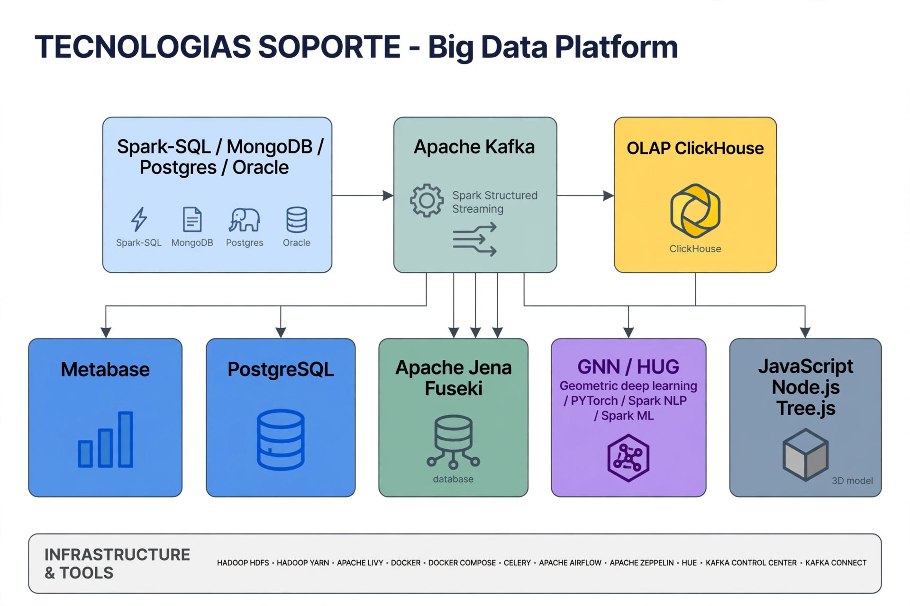

# Kyuubi Troubleshooting - Big Data Platform RCA

> **AI Architect Portfolio | HASSERV / COMIMSA Experience**
> Production incident resolution for Spark + Kyuubi + YARN + HDFS + Airflow + Zeppelin

**Repo hermano:** [ai-knowledge-platform-graphrag](https://github.com/Saxt35/ai-knowledge-platform-graphrag) - GraphRAG Platform (Jena Fuseki + pgvector + ClickHouse) - Faithfulness 0.91

## 🎯 Impacto Real
- **RCA Principal:** 79.7 GB en `/tmp/hive` saturando HDFS → caída en cascada de 3 componentes (Kyuubi, Livy, Zeppelin)
- **Stack:** Spark 3.x, Kyuubi, YARN (4 nodes), HDFS, Hive, Airflow, Zeppelin, Livy, Metabase
- **Resultado:** Plataforma restaurada + Runbook preventivo

## 🏗️ Arquitectura - 5 Capas


1. **Ingesta:** Oracle / Postgres / MySQL / Excel / PDF → Airflow
2. **Staging / Lake:** HDFS (HA) + Hive External Tables
3. **Compute:** Spark + YARN + Kyuubi (JDBC: `jdbc:hive2://<KYUUBI_HOST>:<PORT>`)
4. **Gobernanza:** Metabase (permisos por perfil e intereses) + MDM + Catálogos transversales
5. **Consumo:** Zeppelin (`%kyuubisql` vs `%livykyuubi`), Next.js Portal → Node filter → Jena/pgvector/ClickHouse

## 📚 Documentación (17 guías)

### Fase 1 - Diagnóstico de Plataforma
- `01_Resumen_Ejecutivo_Kyuubi.md` - Resumen ejecutivo del incidente
- `02_Diagnostico_Red_Kyuubi.md` - Diagnóstico de red (`nc -vz`, `Test-NetConnection`)
- `03_Diagnostico_Contenedor_Kyuubi.md` - Diagnóstico de contenedor (`docker top`, `netstat`)
- `10_Diagnostico_HDFS.md` - `hdfs dfsadmin -report`, `du -s -h /tmp/hive`
- `11_Diagnostico_YARN.md` - `yarn node -list` (Total Nodes:4)
- `12_Diagnostico_Kyuubi_Caida.md` - `ps`, `nc`, análisis de logs
- `13_Diagnostico_Livy_Zeppelin.md` - `curl 8998/sessions` (idle/dead)

### Fase 2 - Integración y Consumo
- `04_Airflow_Hive_Kyuubi.md` - DAGs Airflow + Hive
- `05_Zeppelin_Kyuubi.md` - Zeppelin notebooks
- `06_Configuracion_JDBC_Validada.md` - JDBC validada `jdbc:hive2://<HOST>:<PORT>`
- `14_Caso_Real_Spark_Staging.md` - Caso real 79.7 GB (RCA estrella)

### Fase 3 - Gobernanza y Portal
- `07_Runbook_Kyuubi.md` - Runbook preventivo
- `08_Lessons_Learned_Kyuubi.md` - Lecciones aprendidas
- `09_Handbook_Kyuubi_Spark_Caida.md` - Handbook 7 pasos caída Spark
- `15_Metabase_Gobernanza.md` - Metabase + permisos por perfil
- `16_Site_Consultas_Complejas.md` - Next.js -> Node filter -> Jena/pgvector/ClickHouse
- `17_MDM_Gobierno_Datos.md` - MDM Oracle/Postgres/MySQL/Excel/PDF -> catálogos transversales

## 🔧 Runbook Rápido

```bash
# 1. Red
nc -vz <KYUUBI_HOST> 10009
# 2. Contenedor
docker ps | grep kyuubi
# 3. HDFS - Caso estrella 79.7GB
hdfs dfs -du -s -h /tmp/hive
hdfs dfsadmin -report
# 4. YARN
yarn node -list
# 5. Kyuubi + Livy + Zeppelin
ps aux | grep kyuubi
curl http://<LIVY_HOST>:8998/sessions
```

Ver `runbook/runbook.sh` para comandos anonimizados completos.

## 🔗 Ecosistema

- Este repo = **Troubleshooting & Operations** (cómo se cae y cómo se levanta producción)
- Repo hermano `ai-knowledge-platform-graphrag` = **Architecture & AI** (cómo se diseña GraphRAG con faithfulness 0.91)

Ambos demuestran perfil **AI Architect / MDM Lead**.

## 🔒 Seguridad
Todo anonimizado con `<HOST>`, `<USER>`, `<PORT>`. Sin datos de gobierno. Ver `.gitignore`.

---
**Autor:** Noe Briones - AI Architect | Data Engineer | MDM
**Stack:** Spark, Kyuubi, YARN, HDFS, Airflow, Zeppelin, Jena Fuseki, pgvector, ClickHouse, Next.js, Metabase
